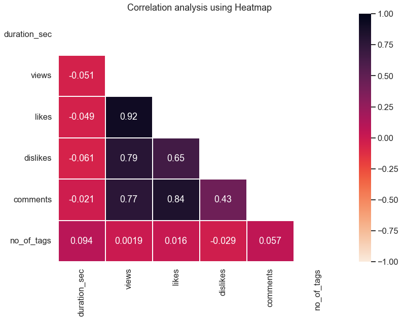

[a]:#top
[b]:YouTube_Popular_Videos_Analysis_1.ipynb
[c]:YouTube_Popular_Videos_Analysis_2.ipynb


<h1 id = "top">    YouTube Popular Videos Analysis :bar_chart: </h1>

This project tries to extract insights and patterns of YouTube's current most popular videos of a specific region (Country; here INDIA). 
Over **20** important attributes of each video is analyzed using **Pandas, NumPy,** etc. and insights are presented in vizualizations
using **Matplotlib** and **Seaborn**.

This project starts with understanding the resources, methods, request parameters, structure of requested data, etc.
for **YouTube Data API v3**. Then, for robust analysis, there is a need of **Database** to store data, collected at different timestamps over a long period
(like 1 month or more).
Here, I have explored the opportunity of using a **Cloud Database**, levaraging the benefits of
**Google Cloud Platform** *( using its free-tier/always-free products only!! )*.
I utilized their **Compute Engine** as virtual machine to install and set-up the database (*NOTE: The Cloud SQL of GCP is not included in the free tier*).

This analysis may help anyone strategize their YouTube journey by understanding
**user preferences, current trends,** improvement scopes etc.

## Outline

- [Some Vizualizations](#some-vizualizations)
- [Required Pyhton libraries and modules](#required-pyhton-libraries-and-modules)
- [Setting-up Compute Engine on Google Cloud Platform](#setting-up-compute-engine-on-google-cloud-platform)
- [Setting-up PostgreSQL on Compute Engine](#setting-up-postgresql-on-compute-engine)
- [Creating Firewall rule for VM](#creating-firewall-rule-for-vm)
- [Enabling YouTube Data API v3](#enabling-youtube-data-api-v3)
- [Understanding YouTube Data API v3](#understanding-youtube-data-api-v3)
- [Storing all credentials as Environment Variables](#storing-all-credentials-as-environment-variables)
- [Data Transformation for efficient memory usage](#data-transformation-for-efficient-memory-usage)
- [Method used to efficiently load data into Database](#method-used-to-efficiently-load-data-into-database)
- [Interacting with Database](#interacting-with-database)
- [Closing Database Connections](#closing-database-connections)
- [Transformed/Generated Columns](#transformedgenerated-columns)
    1. [Rank](#1-rank)
    2. [(Title/Audio)_Language_Name](#2-titleaudiolanguagename)
    3. [Topics](#3-topics)
    4. [Entry_Timestamp](#4-entrytimestamp)
    5. [video_type](#5-videotype)
    6. [duration_tag](#6-durationtag)
    7. [local_publish_time](#7-localpublishtime)
- [Inference, Hypothesis, Validation from Analysis](#inference-hypothesis-validation-from-analysis)
- [Abbreviations Used](#abbreviations-used)
- [Acknowledgement](#acknowledgement)

## Some Vizualizations





**[Go back :top:][a]**

## Required Pyhton libraries and modules

Install with your python package manager, ex.- **pip**, if not already installed,
as these need to be imported. Like - `pip install package_name`.
- datetime
- dotenv
    ```shell
    pip install python-dotenv
    ```
- io
- matplotlib
- numpy
- os
- pandas
- pprint
- psycopg2
- random
- requests
- seaborn

**[Go back :top:][a]**

## Setting-up Compute Engine on Google Cloud Platform

You first need a google billing account and a normal google account ( *which can be same* ). But don't worry, as Google will **not** charge anything if you are within limits.
Also, turn off the auto payments of your billing account so that even if you cross free usage limits,
you will not be charged ( *your service will be terminated if you don't pay* ).

Then go to [Google Cloud Console](https://console.cloud.google.com/)
by logging in with the google account and create a new project. Then go to **Compute Engine** and create a new VM instance.
You will need to add the billing account here.
While choosing the right specifications, follow this [free tier usage limits](https://cloud.google.com/free/docs/gcp-free-tier/#compute)
to avoid any billing.

For any further guides or queries, please follow Google's
[Documentation](https://cloud.google.com/compute/docs).

**[Go back :top:][a]**

## Setting-up PostgreSQL on Compute Engine

Please follow the detailed
[Google Cloud Community Tutorial](https://cloud.google.com/community/tutorials/setting-up-postgres)
contributed by Google employees to set up a PostgreSQL database in your virtual machine
and configure it for remote connections.

**Note:** The guide uses CIDR suffix `/32`, which means a single IPV4 address.
Which is OK for static ip addresses.
But it is most likely that you have dynamic ip address and for that you need
to identify right CIDR suffix by knowing the subnet mask of your network.
Ex.- For 255.255.255.0 types, it should be `/24`.

**[Go back :top:][a]**

## Creating Firewall rule for VM

Now, in order to remotely connect with VM and then the database, we need to create a firewall rule on our compute engine. The previous [Tutorial](https://cloud.google.com/community/tutorials/setting-up-postgres) includes that but here also, remember to replace the CIDR suffix with the right one as applicable.

**[Go back :top:][a]**

## Enabling YouTube Data API v3

From the navigation menu of google cloud console, go to **APIs & Services**. Then follow the path below:

**Library** :arrow_forward: **YouTube Data API v3** :arrow_forward: **Enable**

Now from the dashboard, you need to create **Credentials** for the API as the **API Key** is required. Note that the usage of this API is free with limitation / ***Quota*** of **1000** units per day. And our each API call costs **1** unit.

**[Go back :top:][a]**

## Understanding YouTube Data API v3

One really needs to understand the different methods of the call, calling parameters and the description of output parameters to implement what is intended. For this, please refer to the **Guides** and **Reference** section of [Official Documentation](https://developers.google.com/youtube/v3).

Here, we can play around with all the parameters ( *check hidden parameters also!* ) without spending our daily quotas. One can also see what the response will look like and verify whether the API call was right or incomplete/wrong. The response data will generally be in a nested **JSON** format.

After ensuring the all the parameters are set properly and the call is giving back response with status code 200, you need to choose **SHOW CODE** and grab the **https** URL, automatically generated against your specified parameters. For more info about setting parameters, and slicing parts of some parameters, please follow
[this guide](https://developers.google.com/youtube/v3/getting-started#partial)

In this project, the region is set to **IN** which is the ISO 3166-1 alpha-2 code for my country **India**. But you can change it to any other country code as [acceptable](https://developers.google.com/youtube/v3/docs/i18nRegions) by YouTube, by simply changing the variable `region_code` in [1st Notebook][b]. Also, I have collected 100 videos ( *50 videos in 2 times each* ) although there could be more videos available, upto 200. The process to extract all of them using **loop** is explained in [1st Notebook][b].

**[Go back :top:][a]**

## Storing all credentials as Environment Variables

So, we have to use few credentials for the entire project. These includes your API key for pulling data and database credentials for connecting to the cloud database. These are secrets and should not be published in public. Also, it is better, **not** to hard code these variables, following one of the [12-factor](http://12factor.net/) principles.

Python `dotenv` library provides a good solution. It reads key-value pairs from a `.env` file and can set them as environment variables. Then we can directly use `os.getenv()` to get the environment variables.

This repository contains a sample [.env file](.env_example) which provides a template for the `.env` key-value pairs. Please insert the actual values and then remove the *'_example'* part from the name of the file.

For more info and advanced configuration, please [visit here](https://pypi.org/project/python-dotenv/).

**[Go back :top:][a]**

## Data Transformation for efficient memory usage

After normalizing `JSON` data using `pandas.json_normalize()`, we need to drop redundant columns after extracting useful information from them. Then applying appropriate datatypes we can achieve around **50%** reduced memory usage per column ( *as there is need for additional data wrangling which changes the no. of columns* ) . This is because, `pandas` often store data as objects and our data is mostly in string format even for numeric columns. Also declaring proper categorical column helps a lot!

This might not be that useful in our situation but it is implemented for scalability. Also, we are using the fastest `copy_from(StringIO,...)`  method to load data into database. But it uses high memory proportional to the memory usage of the `DataFrame`. So it is better to perform **data transformation** which also makes possible to run a quick analysis on the small recently collected data if required.

The same is done extensively on the [2nd Notebook][c], as we will be analyzing much bigger dataset ( *currently **5000** rows* ), collected from our database.

**[Go back :top:][a]**

## Method used to efficiently load data into Database

There are many methods to load a `DataFrame` into a database but not all perform the same way.
One should **not** use any loops and execute one insert query at a time unless absolute necessary, as this is highly inefficient/slow. Now for bulk inserts, there are multiple options available. As the no. of rows in our `DataFrame` increases, the performance varries greatly.


Here are two great articles ( **[Article-1](https://naysan.ca/2020/05/09/pandas-to-postgresql-using-psycopg2-bulk-insert-performance-benchmark/), [Article-2](https://hakibenita.com/fast-load-data-python-postgresql)** ) that provide detailed comparison between these methods and the code template for each method. I used one of the *fastest* methods here. Though fastest, this method is not highly memory efficient. Our data transformation will help us in this regard and also there is an excellent work-around mentioned in **[Article-2](https://hakibenita.com/fast-load-data-python-postgresql)**.

**[Go back :top:][a]**

## Interacting with Database

The `psycopg2` wrapper provides `connection` ( *[doc](https://www.psycopg.org/docs/connection.html)* ) and `cursor` ( *[doc](https://www.psycopg.org/docs/cursor.html)* ) classes to execute SQL commands, queries from the python code in a database session.

We also need to follow PostgreSQL [documentation](https://www.postgresql.org/docs/current/index.html), to understand its extention to the standard SQL. Like, declaring `enum` datatypes, inserting arrays as values, acceptable time-zone aware timestamp datatype formats, timedelta/interval formats etc.

**[Go back :top:][a]**

## Closing Database Connections

After executing SQL queries, we need to `commit` for the changes to take effect in the database. Also, if there occurs any error while executing SQL queries, the transaction will be aborted and all commands will be ignored until you use `rollback`.

It is important to close `cursor()`s after completing interactions with the database for safety reasons. Finally, the `connection()` should also be closed.

**[Go back :top:][a]**

## Transformed/Generated Columns

Here are the description of few columns transformed from the raw data and generated at different stages of data pipeline.

### 1. Rank
The index of a video in the response of each API call, starting from 1. As I have collected 100 videos each time, the Rank is in the range **1-100**.

**[Go back :top:][a]**

### 2. (Title/Audio)_Language_Name
Obtained by matching language codes from the API response data of YouTube's **[I18nLanguages](https://developers.google.com/youtube/v3/docs/i18nLanguages)**. In some cases, the code provided by the owner is **not listed** in the API response though the code is valid. But as we are specifically analyzing YouTube related data, 
it has not been decoded going outside the defined scope.

Now for all such cases ( *e.g. bihari dialects, explicitely mentioned **zxx*** ), the code has been changed to `zxx` which according to [ISO639](https://iso639-3.sil.org/code/zxx) stands for **Not Applicable**.

**[Go back :top:][a]**

### 3. Topics
Converted from: ***Topics_Links :arrow_right: Topics***

The API response contains the **Links** of wikipedia pages for specific topics. The name of the topic has been extracted from the **Topics_Llinks** and joined into a comma seperated string for easier insertion into database

**[Go back :top:][a]**

### 4. Entry_Timestamp
This is the timestamp of data collection in **UTC** time. `pandas.Timestamp.utcnow()` is executed in the same code cell where the data is fetched by API. This is necessary as it becomes the part of the `Primary Key` in our database table along with another column; ***video_id*** to uniquely identify a popular video.

**[Go back :top:][a]**

### 5. video_type
Inferred from: ***live_start_real, live_start_scheduled :arrow_right: video_type***

This is the category assignment based on whether a video is/is going to be a **Live Streamed** content or a normal **Uploaded/Posted** video.

**[Go back :top:][a]**

### 6. duration_tag
Inferred from: *** duration :arrow_right: duration_sec :arrow_right: duration_tag***

As we can see from the histogram of the duration_sec distribution, it is extreme positively skewed. So to better understand trends, this category is generated. It categorizes each video into **3** categories, namely ***Shorts, Normal, Long***. Though `YouTube Shorts` is well defined but the other 2 are not. The limiting duration is entirely based on our own experience of what the average is.

This enables us to analyze the newly added YouTube feature, `#SHORTS`.

**[Go back :top:][a]**

### 7. local_publish_time
Converted from: ***maximum ( published_at, live_start_scheduled, live_start_real ) :arrow_right: local_publish_time***

It is the ***UTC*** timestamp converted to ***local*** timestamp. This helps us to understand the *peak hour* of publishing new videos on YouTube that become popular. It indicates the characteristics of content creators, their preferred time to upload new contents, etc.

**[Go back :top:][a]**

## Inference, Hypothesis, Validation from Analysis

In the [Notebook 2][c], under the section
[Performing Data Analysis & Visualization](https://nbviewer.jupyter.org/github/AniketMondal/DA_YouTube_Popular_Videos/blob/master/YouTube_Popular_Videos_Analysis_2.ipynb#3.-Performing-Data-Analysis-&-Visualization.),
all the inferences are provided as `markdown` cells. Similarly, some hypothesis is proposed and I have validated the hypothesis. All related details are provided right after the analysis in the *Notebook* itself. Please check those out following the above link or simply navigating to the [Notebook 2][c].

Few propositions include,
- no. of likes in a video is ~ 5% of its views
- no. of dislikes is ~ 5% of its likes
- etc.

**[Go back :top:][a]**

## Abbreviations Used

Following are the abbreviations used in this Project.

| Short Form | Meaning |
|   :---:    | :---: |
| doc | Documentation |
| enum | Enumerate (Categorical) |
| GCP | Google Cloud Platform |
| Shorts | YouTube Shorts |
| Stats | Statistics |
| VM | Virtual Machine |
| UTC | Coordinated Universal Time |
| `zxx` | No linguistic content, Not applicable |

**[Go back :top:][a]**

## Acknowledgement

- [:tv: The One and Only Data Science Project You Need](https://www.youtube.com/watch?v=c4Af2FcgamA) by *[Nate at StrataScratch](https://www.youtube.com/channel/UCW8Ews7tdKKkBT6GdtQaXvQ)*
- [:tv: Data School](https://www.youtube.com/c/dataschool)
- [:tv: Kimberly Fessel](https://www.youtube.com/channel/UCirb0k3PnuQnRjh8tTJHJuA)
- [:tv: AWS vs Azure vs GCP](https://www.youtube.com/watch?v=n24OBVGHufQ) by *[Intellipaat](https://www.youtube.com/channel/UCCktnahuRFYIBtN)*
- [:tv: An Introduction to GCP for Students](https://www.youtube.com/watch?v=JtUIQz_EkUw) by *[Google Cloud Tech](https://www.youtube.com/channel/UCJS9pqu9BzkAMNTmzNMNhvg)*
- [:tv: The Google Cloud Platform Free Trial and Free Tier](https://www.youtube.com/watch?v=P2ADJdk5mYo) by *[Google Cloud Tech](https://www.youtube.com/channel/UCJS9pqu9BzkAMNTmzNMNhvg)*
- [:tv: Deploying Free Tier (Always Free) VM in Google Cloud Platform - Snapshots, VPC Firewall and more](https://www.youtube.com/watch?v=fMqFxV_0-DQ) by *[Brian V](https://www.youtube.com/channel/UCK9irvCYv9JOAF4U3l228aQ)*

- [:memo: Pandas to PostgreSQL using Psycopg2: Bulk Insert Performance Benchmark](https://naysan.ca/2020/05/09/pandas-to-postgresql-using-psycopg2-bulk-insert-performance-benchmark/)
by *[Naysan Saran](https://naysan.ca/)*
- [:memo: Fastest Way to Load Data Into PostgreSQL Using Python, From two minutes to less than half a second!](https://hakibenita.com/fast-load-data-python-postgresql) by *[Haki Benita](https://hakibenita.com/)*

- [:file_folder: python-dotenv](https://github.com/theskumar/python-dotenv)
- [:file_folder: emoji-cheat-sheet](https://github.com/ikatyang/emoji-cheat-sheet/blob/master/README.md)

- [:notebook_with_decorative_cover: `Pandas` Documentation](https://pandas.pydata.org/docs/)
- [:notebook_with_decorative_cover:	`Psycopg2` Documentation](https://www.psycopg.org/docs/)
- [:notebook_with_decorative_cover:	`PostgreSQL` Documentation](https://www.postgresql.org/docs/current/)
- [:notebook_with_decorative_cover:	`Seaborn` Documentation](https://seaborn.pydata.org/tutorial.html)
- [:notebook_with_decorative_cover:	`Matplotlib` Documentation](https://matplotlib.org/stable/contents.html)

...and there are many more :slightly_smiling_face:	

**[Go back :top:][a]**
